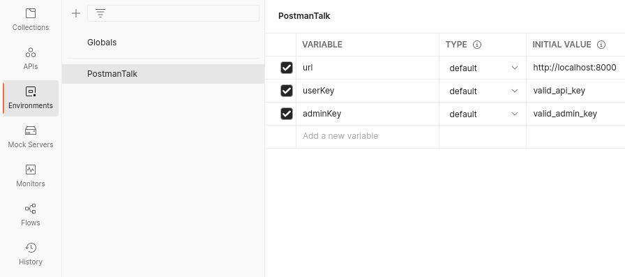
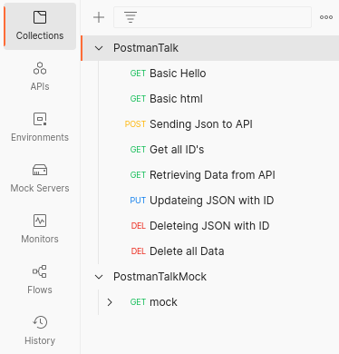
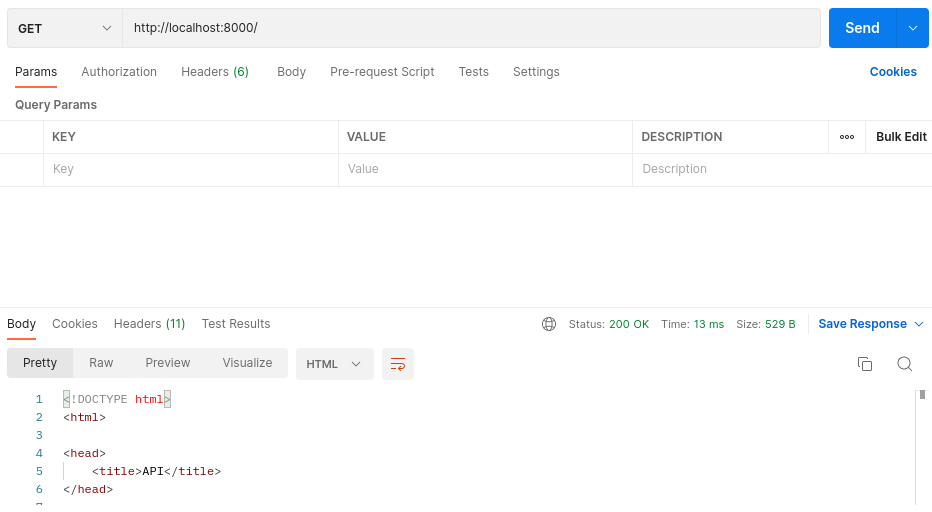

# Lightning Talk
## Postman
### What is Postman?
Postman is a API testing tool that is used for development testing 
### Why use Postman?
1. It is easy to use
2. You can create HTTP Requests easily and fast
3. Its free features are more than enough for basic testing 
### Workspaces
A postman Workspace consists of different things:  
1. Collections
    - These can be used for saving HTTP requests under a named list
2. APIs
    - Documentation for an API
3. Environments
    - You can use different environments for variables with the same name (url, apiToken, ...)   
    - Can also be used for global workspace variables
4. Mock Servers
    - Can be used to simulate an API with default returns for the requests
5. History
    - History of all Requests made in this Workspace
### Requests
You make Requests in a Workspace under the "collections" tab  
  
This is how the requests themselves look like:
  
Here we can see the HTTP method, in this case "get", and a multitude of other tabs.  
  
The most interesting parts of this window are the HTTP Method, URL, Params and body

#### HTTP Methods
Postman has a multitude of different HTTP Methods.  
Just use the Method that you need for your Request
  
#### URL
This is the URL to the API  
  
#### Params
Here you add the Query Parameters to the URL  
  
#### Body
Here you can add the Body you want the Request to have (eg. JSON, HTML, ...)

--------------------------

# API Documentation

## Route: "/"

### Get
URL: **/**  
Get HTML back that says that the API is running  
  
------------------------------------
## Route: "/hello"
  
### Get
URL: **/hello**  
Get Plaintext "Hello, world!" back  
  
------------------------------------
## Route: "/data"
  
### Get
Authentication needed via API Key in Header  
URL: **/data**  
Header: **x-api-key**  
Value: **valid-api-key**  
Returns all saved file IDs and their respective FileName  
  
### Get
URL: **/data/\<id\>**  
Returns data saved in file with id  
  
### Post with query and JSON Body
Authentication needed via API Key in Header  
URL: **/data?\<name\>&\<id\>**  
Header: **x-api-key**  
Value: **valid-api-key**  
Body: **application/json**  
Saves the JSON Body value as file with \<name\> and \<id\>  
  
### Patch
Authentication needed via API Key in Header  
URL: **/data/\<id\>**
Header: **x-api-key**  
Value: **valid-api-key**  
Body: **application/json**  
Overwrites saved data with \<id\> with the body of the request  
  
### Delete with ID
Authentication needed via API Key in Header  
URL: **/data/\<id\>**  
Header: **x-api-key**  
Value: **valid-api-key**  
Body: **application/json**  
Deletes File with \<id\>

### Delete
Authentication needed via API Key in Header  
URL: **/data**  
Header: **x-api-key**  
Value: **valid-api-key**  
Body: **application/json**  
Deletes all saved data
